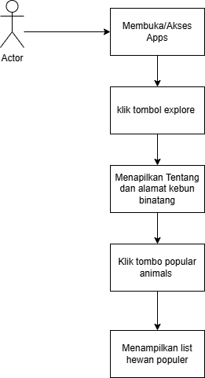

# Mobile App Kebun Binatang Surabaya

Aplikasi mobile ini dirancang untuk mempermudah pengunjung Kebun Binatang Surabaya dalam mencari informasi tentang kebun binatang surabaya ,koleksi satwa populer di kebun binatang surabaya, dan lokasi Aplikasi ini memberikan pengalaman wisata yang informatif 

---

## 📋 Business Domain
- **Nama:** Mobile App Kebun Binatang Surabaya
- **Business Process:** Pengenalan dan pencarian informasi seputar Kebun Binatang Surabaya
- **Status:** Release
- **Tanggal:** November 2024

---

## 📖 Introduction
Kebun Binatang Surabaya adalah salah satu destinasi wisata edukasi dan konservasi terpopuler di Indonesia. Namun, pengunjung sering kali mengalami kesulitan dalam mendapatkan informasi lengkap terkait koleksi satwa, zona asal,  Oleh karena itu, aplikasi ini dirancang untuk memberikan informasi terintegrasi guna mempermudah pengunjung dalam menjelajahi Kebun Binatang Surabaya.

---

## 🎯 Objective
- Memudahkan pengunjung untuk mendapatkan informasi tentang koleksi satwa dan fasilitas Kebun Binatang Surabaya.
- Memberikan pengalaman wisata yang edukatif melalui teknologi digital.
- Mendukung pelestarian satwa dengan memperkenalkan informasi habitat dan konservasi.

---

## 📌 Scope
### **Batasan:**
- Aplikasi hanya mencakup informasi satwa, tentang dan lokasi kebun Binatang Surabaya.

### **Kriteria:**
- Pengunjung dapat dengan mudah mencari informasi satwa .
- Menyediakan fitur rencana kunjungan dan peta navigasi untuk memandu wisatawan.

---

## 📊 Business Requirement
### **Jenis Layanan:** Layanan Informasi
### **Definisi:**
Aplikasi ini memberikan informasi lengkap tentang koleksi satwa, lokasi asal, serta lokasikebun Binatang Surabaya. 

### **Abstrak:**
Kebun Binatang Surabaya memiliki lebih dari 300 spesies satwa dari berbagai belahan dunia. Melalui aplikasi ini, pengunjung dapat menemukan koleksi satwa secara virtual, memahami pentingnya konservasi, dan mendapatkan panduan kunjungan yang optimal.

---

## ⚙️ Features and Functions
### **Fungsi Teknis**
1. **List Satwa**  
   - Menampilkan daftar satwa lengkap dengan gambar, nama, deskripsi, dan lokasi habitat.

2. **Detail Satwa**  
   - Informasi detail meliputi deskripsi, gambar, nama, dan asal.

3. **alamat**  
   - Menyediakan alamat lengkap di halaman tentang.

### **Fungsi Strategis**
- **Kinerja:**  
  Memberikan solusi bagi pengunjung untuk mendapatkan informasi secara efisien.
- **Keunggulan:**  
  Antarmukayang user friendly dan responsive

---

## 🔄 Process Flow
1. Pengunjung membuka aplikasi melihat tampilan home
2. Pengunjung dapat mengklik explore untuk ke halaman tentang
3. Sistem menampilkan halaman tentang yg berisis tentang kebun binatang dan alamat
4. Pengunjung mengklik tombol animals populer.
5. Pengunjung dapatmengakses halaman animals populer yg berisi list satwa yg populer di kebun binatang surabaya

---
##  Diagram Ptocess flows

## Tools 
Flutter